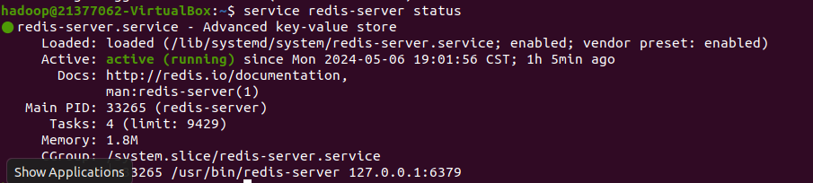

# 21377062-王悦扬-第10周作业

## 1. Kafaka安装配置

### 1.1 Kafka安装

访问Kafka官网下载页面（https://kafka.apache.org/downloads），下载 [kafka_2.13-3.7.0.tgz](https://downloads.apache.org/kafka/3.7.0/kafka_2.13-3.7.0.tgz) 到虚拟机“~/Downloads”目录下。

执行如下命令完成Kafka的安装：

```bash
cd ~/Downloads
sudo tar -zxf  kafka_2.13-3.7.0.tgz -C /usr/local
cd /usr/local
sudo mv kafka_2.13-3.7.0 kafka
sudo chown -R hadoop ./kafka
```


### 1.2 部署Kafka伪分布式集群

进入kafka目录，在此目录下建立一个目录etc，将config文件夹中的zookeeper.properties复制到etc文件目录中。

```bash
cd /usr/local/kafka
sudo mkdir etc
cd /usr/local/kafka/config	         
sudo mv zookeeper.properties /usr/local/kafka/etc  
```


将config文件夹中的server.properties复制三份至etc文件目录中，分别命名为server-0.properties、server-1.properties、server-2.properties

```bash
cd /usr/local/kafka/config  
sudo cp server.properties /usr/local/kafka/etc/server-0.properties 	 
sudo cp server.properties /usr/local/kafka/etc/server-1.properties 
sudo cp server.properties /usr/local/kafka/etc/server-2.properties  
```


### 1.3 配置server-X.properties文件

分别编辑三个broker配置server-X.properties文件中的以下信息：

```bash
broker.id = X  
listeners = PLAINTEXT://:9092(9093,9094)    
log.dirs.=/tmp/kafka-logsX 
```

操作命令：

```bash
cd /usr/local/kafka/etc
sudo vim ../etc/server-0.properties      
sudo vim ../etc/server-1.properties      
sudo vim ../etc/server-2.properties     
```


对于3个伪分布式集群分别进行修改

### 1.4 启动zookeeper服务器和kafka集群

首先启动zookeeper：

```bash
cd /usr/local/kafka 
./bin/zookeeper-server-start.sh  etc/zookeeper.properties
```


启动kafka集群

```bash
cd /usr/local/kafka
./bin/kafka-server-start.sh  etc/server-0.properties   
./bin/kafka-server-start.sh  etc/server-1.properties  
./bin/kafka-server-start.sh  etc/server-2.properties 
```


启动集群看是否成功

```
jps
```


## 2. Java API实现数据统计到JSON

### 2.1 配置Topic

创建3个Topic以完成任务，分别是`comments`, `likes`, 和 `shares`

```bash
cd /usr/local/kafka
./bin/kafka-topics.sh --create --topic comments --partitions 3 --replication-factor 2 --bootstrap-server localhost:9092,localhost:9093,localhost:9094

./bin/kafka-topics.sh --create --topic likes --partitions 3 --replication-factor 2 --bootstrap-server localhost:9092,localhost:9093,localhost:9094

./bin/kafka-topics.sh --create --topic shares --partitions 3 --replication-factor 2 --bootstrap-server localhost:9092,localhost:9093,localhost:9094
```


查看创建的Topics

```bash
cd /usr/local/kafka
./bin/kafka-topics.sh --describe --topic comments --bootstrap-server localhost:9092,localhost:9093,localhost:9094
./bin/kafka-topics.sh --describe --topic likes,shares --bootstrap-server localhost:9092,localhost:9093,localhost:9094
```


### 2.2 项目创建与环境配置

创建java项目，导入kafka/libs下的所有jar包，并创建3个文件（SocialMediaApp.class, SocialMediaConsumer.class, SocialMediaProducter.class)


### 2.3 程序编写

SocialMediaConsumer.class

```java
import com.fasterxml.jackson.databind.ObjectMapper;
import com.fasterxml.jackson.databind.node.ObjectNode;
import java.io.FileWriter;
import java.util.Arrays;
import java.util.HashMap;
import java.util.HashSet;
import java.util.Iterator;
import java.util.Map;
import java.util.Properties;
import java.util.Set;
import org.apache.kafka.clients.consumer.ConsumerRecord;
import org.apache.kafka.clients.consumer.ConsumerRecords;
import org.apache.kafka.clients.consumer.KafkaConsumer;
import org.apache.kafka.common.serialization.StringDeserializer;

public class SocialMediaConsumer {
    private static final ObjectMapper mapper = new ObjectMapper();

    public SocialMediaConsumer() {
    }

    public static void main(String[] args) {
        Properties props = new Properties();
        props.put("bootstrap.servers", "localhost:9092,localhost:9093,localhost:9094");
        props.put("group.id", "social-media-group");
        props.put("key.deserializer", StringDeserializer.class.getName());
        props.put("value.deserializer", StringDeserializer.class.getName());
        props.put("auto.offset.reset", "earliest");
        KafkaConsumer<String, String> consumer = new KafkaConsumer(props);
        consumer.subscribe(Arrays.asList("likes", "comments", "shares"));
        Map<String, Set<String>> userComments = new HashMap();
        Map<String, Map<String, Integer>> userLikes = new HashMap();
        Map<String, Integer> userPopularity = new HashMap();
        int giveUp = true;
        int noRecordsCount = 0;

        try {
            while(true) {
                ConsumerRecords<String, String> records = consumer.poll(100L);
                if (records.count() == 0) {
                    noRecordsCount += 100;
                    if (noRecordsCount > 10000) {
                        return;
                    }
                } else {
                    noRecordsCount = 0;
                    System.out.println("Received " + records.count() + " records");
                }

                Iterator var10 = records.iterator();

                while(var10.hasNext()) {
                    ConsumerRecord<String, String> record = (ConsumerRecord)var10.next();
                    processRecord(record, userComments, userLikes, userPopularity);
                }

                if (!records.isEmpty()) {
                    try {
                        writeToJsonFiles(userComments, userLikes, userPopularity);
                    } catch (Exception var14) {
                    }
                }
            }
        } finally {
            consumer.close();
            System.out.println("Consumer closed");
        }
    }

    private static void processRecord(ConsumerRecord<String, String> record, Map<String, Set<String>> userComments, Map<String, Map<String, Integer>> userLikes, Map<String, Integer> userPopularity) {
        System.out.println((String)record.value());
        String[] parts = ((String)record.value()).split(" ");
        String userWhoPosted = parts[1];
        String postId = parts[2];
        System.out.println(topic);
        switch (topic) {
            case "shares":
                int shareCount = parts.length - 3;
                userPopularity.merge(userWhoPosted, 20 * shareCount, Integer::sum);
                break;
            case "comments":
                String comment = parts[3];
                ((Set)userComments.computeIfAbsent(userWhoPosted, (k) -> {
                    return new HashSet();
                })).add(comment);
                userPopularity.merge(userWhoPosted, 5, Integer::sum);
                break;
            case "likes":
                ((Map)userLikes.computeIfAbsent(userWhoPosted, (k) -> {
                    return new HashMap();
                })).put(postId, (Integer)((Map)userLikes.getOrDefault(userWhoPosted, new HashMap())).getOrDefault(postId, 0) + 1);
                userPopularity.merge(userWhoPosted, 1, Integer::sum);
        }

    }

    private static void writeToJsonFiles(Map<String, Set<String>> userComments, Map<String, Map<String, Integer>> userLikes, Map<String, Integer> userPopularity) throws Exception {
        Throwable var3 = null;
        Object var4 = null;

        try {
            FileWriter commentsWriter = new FileWriter("comments.json");

            try {
                FileWriter likesWriter = new FileWriter("likes.json");

                try {
                    FileWriter popularityWriter = new FileWriter("popularity.json");

                    try {
                        mapper.writeValue(commentsWriter, userComments);
                        mapper.writeValue(likesWriter, userLikes);
                        ObjectNode popularityJson = mapper.createObjectNode();
                        userPopularity.forEach((user, popularity) -> {
                            popularityJson.put(user, (double)popularity / 1000.0);
                        });
                        mapper.writeValue(popularityWriter, popularityJson);
                    } finally {
                        if (popularityWriter != null) {
                            popularityWriter.close();
                        }

                    }
                } catch (Throwable var26) {
                    if (var3 == null) {
                        var3 = var26;
                    } else if (var3 != var26) {
                        var3.addSuppressed(var26);
                    }

                    if (likesWriter != null) {
                        likesWriter.close();
                    }

                    throw var3;
                }

                if (likesWriter != null) {
                    likesWriter.close();
                }
            } catch (Throwable var27) {
                if (var3 == null) {
                    var3 = var27;
                } else if (var3 != var27) {
                    var3.addSuppressed(var27);
                }

                if (commentsWriter != null) {
                    commentsWriter.close();
                }

                throw var3;
            }

            if (commentsWriter != null) {
                commentsWriter.close();
            }

        } catch (Throwable var28) {
            if (var3 == null) {
                var3 = var28;
            } else if (var3 != var28) {
                var3.addSuppressed(var28);
            }

            throw var3;
        }
    }
}
```

SocialMediaProducter.class

```java
import java.io.BufferedReader;
import java.io.FileReader;
import java.io.IOException;
import java.util.Properties;
import org.apache.kafka.clients.producer.Callback;
import org.apache.kafka.clients.producer.KafkaProducer;
import org.apache.kafka.clients.producer.Producer;
import org.apache.kafka.clients.producer.ProducerRecord;
import org.apache.kafka.clients.producer.RecordMetadata;

public class SocialMediaProducter {
    public SocialMediaProducter() {
    }

    public static void main(String[] args) {
        String inputFile = "/home/hadoop/Downloads/datasets/student_dataset.txt";
        Properties props = new Properties();
        props.put("bootstrap.servers", "localhost:9092,localhost:9093,localhost:9094");
        props.put("key.serializer", "org.apache.kafka.common.serialization.StringSerializer");
        props.put("value.serializer", "org.apache.kafka.common.serialization.StringSerializer");
        Producer<String, String> producer = new KafkaProducer(props);

        try {
            Throwable var4 = null;
            Object var5 = null;

            try {
                BufferedReader br = new BufferedReader(new FileReader(inputFile));

                try {
                    while(true) {
                        String line;
                        while((line = br.readLine()) != null) {
                            String[] parts = line.split(" ", 2);
                            if (parts.length < 2) {
                                System.err.println("Skipping malformed line: " + line);
                            } else {
                                String type;
                                label295: {
                                    type = parts[0].toLowerCase();
                                    final String message = parts[1];
                                    final String topic;
                                    switch (type.hashCode()) {
                                        case 3321751:
                                            if (!type.equals("like")) {
                                                break label295;
                                            }

                                            topic = "likes";
                                            break;
                                        case 109400031:
                                            if (!type.equals("share")) {
                                                break label295;
                                            }

                                            topic = "shares";
                                            break;
                                        case 950398559:
                                            if (type.equals("comment")) {
                                                topic = "comments";
                                                break;
                                            }
                                        default:
                                            break label295;
                                    }

                                    producer.send(new ProducerRecord(topic, (Object)null, message), new Callback() {
                                        public void onCompletion(RecordMetadata metadata, Exception exception) {
                                            if (exception != null) {
                                                System.err.println("Failed to send message: " + message + " to topic: " + topic);
                                                exception.printStackTrace();
                                            } else {
                                                System.out.println("Sent message: " + message + " to topic: " + topic);
                                            }

                                        }
                                    });
                                    continue;
                                }

                                System.err.println("Unknown type: " + type + " in line: " + line);
                            }
                        }

                        return;
                    }
                } finally {
                    if (br != null) {
                        br.close();
                    }

                }
            } catch (Throwable var27) {
                if (var4 == null) {
                    var4 = var27;
                } else if (var4 != var27) {
                    var4.addSuppressed(var27);
                }

                throw var4;
            }
        } catch (IOException var28) {
            var28.printStackTrace();
        } finally {
            producer.close();
        }

    }
}
```

SocialMediaApp.class

```java
import java.io.IOException;

public class SocialMediaApp {
    public static void main(String[] args) {
        Thread consumerThread = new Thread(() -> {
        	SocialMediaRedisConsumer.main(new String[]{});
        });

        Thread producerThread = new Thread(() -> {
            try {
                Thread.sleep(500);
            } catch (InterruptedException e) {
                e.printStackTrace();
            }
            SocialMediaProducer.main(new String[]{});
        });

        consumerThread.start();
        producerThread.start();
    }
}
```

### 2.4 运行结果


## 3. Java API数据统计到Redis

### 3.1 安装配置Redis数据库

```bash
sudo apt-get install redis-server
```


查看redis是否正常启动

```bash
service redis-server status
```



### 3.2 程序编写

SocialMediaRedisConsumer.class

```java
import redis.clients.jedis.Jedis;
import org.apache.kafka.clients.consumer.ConsumerRecord;
import org.apache.kafka.clients.consumer.ConsumerRecords;
import org.apache.kafka.clients.consumer.KafkaConsumer;
import org.apache.kafka.clients.consumer.ConsumerConfig;
import org.apache.kafka.common.serialization.StringDeserializer;

import java.util.*;

public class SocialMediaRedisConsumer {
    private static Jedis jedis;

    public static void main(String[] args) {
        jedis = new Jedis("localhost", 6379);
        System.out.println("Connected to Redis");

        Properties props = new Properties();
        props.put(ConsumerConfig.BOOTSTRAP_SERVERS_CONFIG, "localhost:9092,localhost:9093,localhost:9094");
        props.put(ConsumerConfig.GROUP_ID_CONFIG, "social-media-group");
        props.put(ConsumerConfig.KEY_DESERIALIZER_CLASS_CONFIG, StringDeserializer.class.getName());
        props.put(ConsumerConfig.VALUE_DESERIALIZER_CLASS_CONFIG, StringDeserializer.class.getName());
        props.put(ConsumerConfig.AUTO_OFFSET_RESET_CONFIG, "earliest");

        KafkaConsumer<String, String> consumer = new KafkaConsumer<>(props);
        consumer.subscribe(Arrays.asList("likes", "comments", "shares"));

        final int giveUp = 10000; // 10 seconds timeout
        int noRecordsCount = 0;

        try {
            while (true) {
                ConsumerRecords<String, String> records = consumer.poll(100);
                if (records.count() == 0) {
                    noRecordsCount += 100;
                    if (noRecordsCount > giveUp) break;
                } else {
                    noRecordsCount = 0;
                    System.out.println("Received " + records.count() + " records");
                }

                for (ConsumerRecord<String, String> record : records) {
                    processRecord(record);
                }
            }
        } finally {
            consumer.close();
            jedis.close();
            System.out.println("Consumer and Redis client closed");
        }
    }

    private static void processRecord(ConsumerRecord<String, String> record) {
        String[] parts = record.value().split(" ");
        String topic = record.topic();
        String userWhoPosted = parts[1];
        String postId = parts[2];

        switch (topic) {
            case "likes":
                String likesKey = "likes:" + userWhoPosted + ":" + postId;
                jedis.hincrBy(userWhoPosted, postId, 1);
                break;
            case "comments":
                String comment = parts[3];
                jedis.rpush("comments:" + userWhoPosted, comment);
                break;
            case "shares":
                int shareCount = parts.length - 3;
                jedis.incrBy("popularity:" + userWhoPosted, 20 * shareCount);
                break;
        }
    }
}
```

### 3.3 运行结果


查看运行结果

```bash
redis-cli
KEYS *
```


## 4. 问题及解决方案

4.1 启动Kafka集群时报错

检查发现配置文件时未修改broker id，但修改完成后仍然报错：


查询日志文件的存储位置：


编辑meta.properties的broker id，与配置文件一致后，成功解决报错。